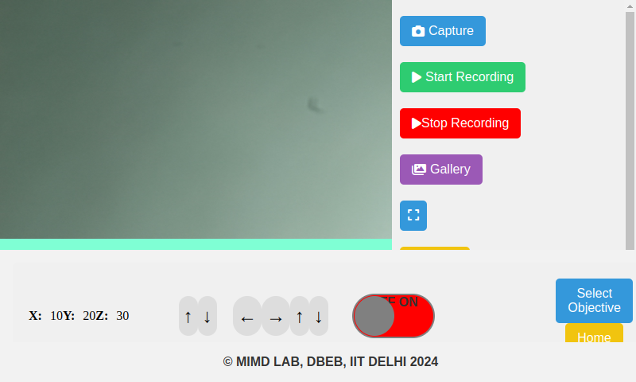
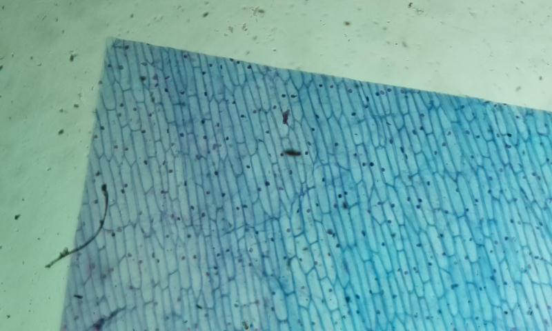

# Autoscope_Ver_1.1
Autoscope Software version 1.1 is ready 

```bash 
1-> css need to Update 
2-> video capture Module work is (DONE) Both starting and stopping(Refinement Needed)
3-> Motor control with user(Module is Done) But only integration with main UI is left
4-> resolution (4056X3040) image is capturing But Lag is there 
```
```bash 
Packages we have tp Install:
See requirements.txt for details
```
```bash 
OS: Rasbian Bullseye
Hardware:Raspberry pi 4 ,Ardino
```
### Installation of Package getting system ready:
```bash 
git clone https://github.com/
cd wherever you have clone the repository
pip install -r requirements.txt


```
### How to run Flask Application
After installing the packages :run the following command
```bash 
python3 app_update.py
run localhost:// on your browser

```

### screenshots


captured Images of plant cell


